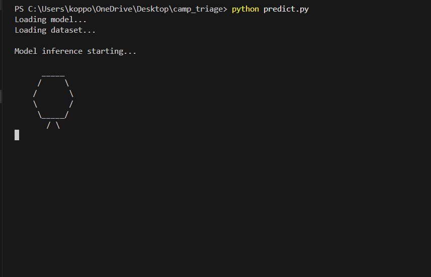

# Camp Triage Optimizer

This repository contains a **machine learning model** to predict **Emergency Severity Index (ESI) levels** for patients based on clinical and lab data. The project is designed for hackathon demos and easy testing.

---

## Project Structure
camp_triage/
│
├── train_model.py # Script to train the ESI prediction model
├── predict.py # Script to predict ESI for a single patient
├── triage_model.pkl # Trained ML model
├── model_columns.pkl # Columns/features used in training
├── requirements.txt # Python dependencies
└── data/
└── triage_data.csv # Sample dataset

---

How to Run

Clone the repository:

git clone https://github.com/KoppoluSrinidhi01/camp_triage_.git
cd camp_triage_

Run the prediction script:

python predict.py
Example:

sample["age"] = 30
sample["glucose_min"] = 120
sample["hemoglobin_min"] = 12.5
sample["2ndarymalig"] = 0   # 0 = no, 1 = yes
sample["abdomhernia"] = 1   # 0 = no, 1 = yes

After modifying these values, rerun:

python predict.py

…and see the updated ESI prediction.
Outputs:

